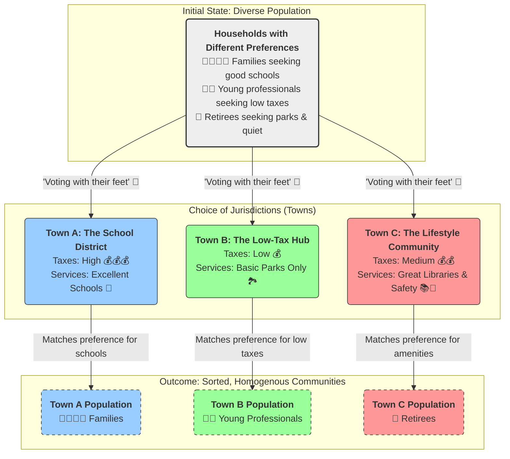

```mermaid
graph TD
    subgraph "Initial State: Diverse Population"
        H("<b>Households with Different Preferences</b><br>👨‍👩‍👧‍👦 Families seeking good schools<br>👨‍💻 Young professionals seeking low taxes<br>🌳 Retirees seeking parks & quiet")
    end

    subgraph "Choice of Jurisdictions (Towns)"
        direction LR
        A("<b>Town A: The School District</b><br>Taxes: High 💰💰💰<br>Services: Excellent Schools 🏫")
        B("<b>Town B: The Low-Tax Hub</b><br>Taxes: Low 💰<br>Services: Basic Parks Only 🏞️")
        C("<b>Town C: The Lifestyle Community</b><br>Taxes: Medium 💰💰<br>Services: Great Libraries & Safety 📚🚓")
    end

    subgraph "Outcome: Sorted, Homogenous Communities"
        direction LR
        A_Sorted("<b>Town A Population</b><br>👨‍👩‍👧‍👦 Families")
        B_Sorted("<b>Town B Population</b><br>👨‍💻 Young Professionals")
        C_Sorted("<b>Town C Population</b><br>🌳 Retirees")
    end

    H -->|'Voting with their feet' 👣| A
    H -->|'Voting with their feet' 👣| B
    H -->|'Voting with their feet' 👣| C
    
    A -- "Matches preference for schools" --> A_Sorted
    B -- "Matches preference for low taxes" --> B_Sorted
    C -- "Matches preference for amenities" --> C_Sorted

    style H fill:#eee,stroke:#333,stroke-width:2px
    style A fill:#9cf,stroke:#333
    style B fill:#9f9,stroke:#333
    style C fill:#f99,stroke:#333
    style A_Sorted fill:#9cf,stroke:#333,stroke-dasharray: 5 5
    style B_Sorted fill:#9f9,stroke:#333,stroke-dasharray: 5 5
    style C_Sorted fill:#f99,stroke:#333,stroke-dasharray: 5 5
```
